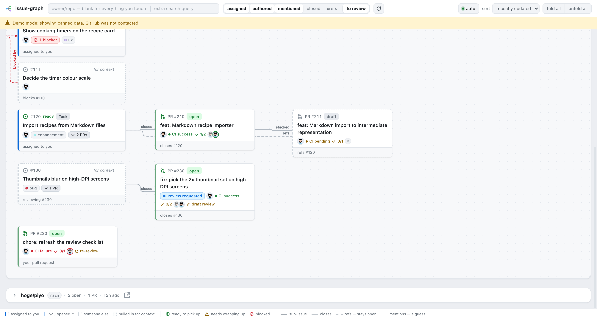
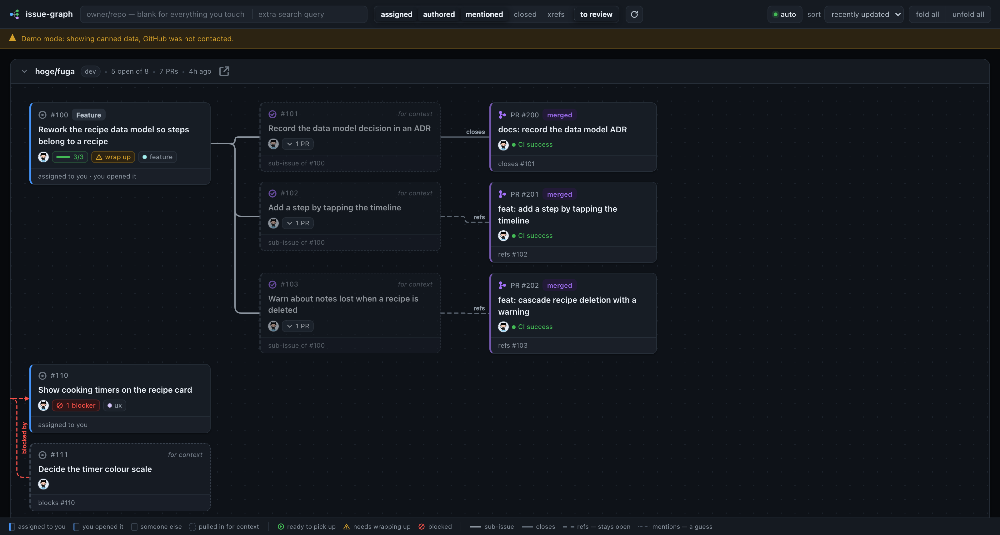

# gh-issue-graph

**日本語** | [English](README.en.md)

issue をグラフとして描く GitHub CLI 拡張です。issue の親子関係が幹になり、それを実装する pull request が枝先にぶら下がります。



<details>
<summary>ダークモード</summary>



</details>

リポジトリはグラフを囲む枠として描きます。

## gh-pr-graph と並んで — 見ている軸の違い

アイデアの元は [`gh-pr-graph`][pr-graph] です。違いは見ている軸です。

`gh-pr-graph` はブランチの軸を描きます。pull request と、それがどのブランチの上に積まれているか。ブランチをスタックして作業しているなら、必要なのはこちらです。`gh-issue-graph` はブランチの階層を幹にしません。pull request どうしが base と head で繋がっていれば線は引きます。issue に紐づいていない pull request の間でも引きます。base か head がデフォルトブランチにあたる組み合わせだけは除きます。

`gh-issue-graph` は issue の軸を描きます。私は普段のタスク管理を pull request ではなく issue ベースでやることが多く、pull request だけでなく紐づく issue も一緒に見たかったので作りました。1 つの親 issue に複数の sub-issue があり、それぞれを別の pull request が実装する、という形です。

そこで issue の階層を X 軸に置き、pull request をそこからぶら下げています。

同じように issue ベースで管理している方に、触ってみていただけると嬉しいです。

## インストール

```console
gh extension install vanilla-bar/gh-issue-graph
```

## 使い方

```console
gh issue-graph                                  # 自分が関わっている全リポジトリ
gh issue-graph -repo owner/name                 # 1 リポジトリだけ
gh issue-graph -port 9000 -no-open              # ポートを指定し、ブラウザは開かない
```

`127.0.0.1:8788` でローカルサーバーを起動し、ブラウザを開きます。すべてのリクエストは `gh api graphql` のサブプロセス経由で発行するので、トークンが `gh` の外に出ることはありません。

| フラグ | デフォルト | 内容 |
|---|---|---|
| `-repo` | _(なし)_ | `OWNER/NAME` に限定する。指定しなければ、関わっている全リポジトリにまたがる。 |
| `-port` | `8788` | ローカルポート。`0` で空きポートを自動選択。`8788` が使用中なら自動的に別のポートへ退避する。 |
| `-no-open` | `false` | ブラウザを起動しない。 |
| `-hostname` | _(gh の設定)_ | GitHub Enterprise のホスト名。 |
| `-refs-pattern` | 後述 | pull request 本文中の、クローズを伴わない参照を拾う正規表現。 |

ブラウザ側のコントロールはこれらに対応しているほか、`to review`（自分のレビュー待ちの pull request。デフォルトで ON）、`closed`（検索自体が拾ったクローズ済み issue を残す）、`xrefs`（緩い相互参照も描く。ノイズが多いためデフォルト OFF）があります。

### スコープ

`assigned`・`authored`・`mentioned` はそれぞれ独立に検索を投げ、結果をマージします。リポジトリ指定はこれらを置き換えるのではなく絞り込みます。`-repo hoge/fuga` に `assigned` だけをチェックした状態は「そのリポジトリで自分にアサインされている issue」です。リポジトリを指定して 3 つとも外せば、リポジトリ全体が見えます。

`to review` だけは issue ではなく pull request を検索します（`is:pr is:open review-requested:@me`）。他人の pull request なので issue 検索では返ってきません。`closed` の設定にかかわらず常に open のみです。

拾った pull request には逆引きをかけます。その pull request がクローズすると宣言している issue、あるいは `refs #N` で名指ししている issue を取得して親に据えます。これでレビュー依頼が最初の列に浮いたままにならず、属する作業の下に現れます。こうして引き寄せられた issue には `reviewing #356` と表示されます。pull request のタイトルに書かれただけの `#N` は追いかけません。

検索にヒットしなかった issue も現れることがあります。親・子・ブロッカー・レビュー依頼の対象は、木が途中で切れないように引き込みます。これらは破線の枠で描かれ、`for context` と表示されます。

### 上限

issue は 500 件、pull request を走査するリポジトリは 20 件、issue の階層をたどる回数は 20 回で打ち切ります。どれかに達したときは画面上部に警告が出ます。`-repo` やスコープで範囲を狭めれば、打ち切りに掛からずに全体が見えます。`-repo` を指定した場合、走査対象はそのリポジトリ 1 つになります。

### リポジトリレーン

リポジトリごとに 1 レーンです。デフォルトの並び順は最後に動いた順で、`sort` コントロールで名前順・open issue 数順に切り替えられます。レーンは最初すべて畳まれています。

## 図の読み方

### ノード

| | 意味 |
|---|---|
| 左端が濃い青 | 自分にアサインされている |
| 左端が淡い青 | 自分が立てた |
| 左端に色なし | 他人のもの |
| 破線の枠、`for context` | 関係を補完するためだけに引き込まれたもの。誰も要求していない |
| ⊙ | open |
| ▶ 緑、`ready` | **着手できる**: open で、ブロックされておらず、未完了の子もなく、`wrap up` も付いておらず、重複でもなく、自分のもの（アサインされているか自分が立てた）。加えて、グラフ内に実際にブロックされているものがあるときだけ表示される（そうでなければ、このバッジは何も言っていないのと同じため） |
| ✓ 紫、カードが薄い | closed |
| ⚠ `wrap up` | **締め忘れ**: sub-issue はすべて完了しているのに issue が open のまま、または pull request がマージ済みなのに閉じられていない |
| ⊘ `1 blocker` | 他の issue を待っている |
| `4/6` とメーター | sub-issue の進捗。キャンバスに子がいるときはボタンになり、クリックでその子孫と、ぶら下がる pull request を畳む。**デフォルトで表示** |
| ラベルの色付きドット | GitHub 上でそのラベルに設定された色。ラベル名自体は、色が何であれ読めるコントラストを保つ |
| PR カードの `merged` / `open` / `draft` / `closed` | 状態を、語とカード左端の色の両方で示す |
| `👁 review requested` | GitHub が**自分**のレビューを待っている。作業内容ではなく自分に関する情報なので、他と同じく青 |
| 全カードの最終行 | **なぜキャンバスに載っているか**: `assigned to you`、`you opened it`、`sub-issue of #321`、`closes #534`、`refs #325`、`blocks #110`、`your pull request` |
| レーンヘッダー | クリックでリポジトリを開閉。`↗` は GitHub 上で開く |
| `⌄ 2 PRs` | その issue の pull request。**デフォルトで表示**。クリックで畳めるが、どちらの操作でも再取得は発生しない |
| カード右上の `⌃` | カードにポインターを乗せると出る。押すと 1 行に縮み、その issue の sub-issue と pull request も一緒に畳まれる。行末に `3 sub · 3 PRs` と、何が下に入ったかが出る |

どのリポジトリを開いたか、どこを畳んだか、どのカードを縮めたかは `localStorage` に記憶されるので、リロードしても元の場所に戻ります。`unfold all` は畳んだものを開きますが、縮めたカードはそのままです。

### エッジ

| 線 | 意味 |
|---|---|
| 太い実線 | sub-issue の階層。グラフの幹 |
| PR への実線 | `Closes #123`: マージすれば issue も閉じる |
| PR への**破線** | `refs #123`: 意図的に関連付けられているが、issue は open のまま |
| PR への**薄い点線** | キーワードなしでタイトルに `#123` とあるだけ。こちらの推測であり、唯一間違いうる線 |
| PR → PR の実線 | スタックされた pull request（base が相手の head） |
| 赤い破線の矢印 | ブロックされている |
| issue 間の薄い点線 | 重複 |

pull request への 3 種類の線は、確からしさの高い順に並んでいます。薄い点線だけが推測です。幹以外の線には `closes`、`refs`、`mentions?`、`stacked`、`blocked by`、`duplicate` のラベルを線上に書くので、線種を凡例と照合する必要はありません。カードにホバーすると、そのカードに繋がっていない線が減光されます。

## issue と pull request の紐付け方

リンクは 3 つの層で収集します（加えて、デフォルト OFF の 4 層目があります）。

| 層 | 情報源 | 描画 |
|---|---|---|
| 1 | `closingIssuesReferences` | 実線 |
| 2 | 本文中の `refs #N` | 破線 |
| 3 | タイトル中の裸の `#N` — `feat(parse): #603 ...` | 薄い点線 |
| 4 | タイムラインの相互参照 | 薄い点線。`xrefs` 有効時のみ |

層 3 は、既にキャンバス上にある issue の番号しか信用しません。タイトルに紛れ込んだ `#5` がリンクを作ることはありません。どの層から来たリンクかは各カードに表示されます。

層 1 の `closingIssuesReferences` は、GitHub がデフォルトブランチ向けの pull request にしか付けません。`dev` のような別のブランチに向けた pull request では、本文に `Closes #123` と書いても層 1 には現れません。その場合は `refs #123` を書けば層 2 として拾います。

キャンバス上のどの issue も実装していない pull request が残るのは、自分の open な作業か、自分のレビュー待ちの場合だけです。

層 2 は API ではなく慣習です。デフォルトのパターンは、行頭の `refs #123`、`Refs: #12, #34`、`ref #8` にマッチします。

```
(?im)^[ \t>*-]*refs?[:：]?[ \t]+((?:#\d+[ \t,、]*)+)
```

チームの書き方が違う場合は `-refs-pattern` を使ってください。1 番目のサブマッチが `#12, #34` の部分を捉える必要があります。

## コスト

スコープごとに検索 1 回を投げ、階層は `nodes(ids:)` でまとめて展開します（ID をいくつ積んでも 1 回あたり 1 ポイント）。チェックのロールアップ（`● CI passing`）はキャンバスに載った pull request だけを対象に取得します。リポジトリ 1 つあたり数ポイントで、数秒で終わります。

## 開発

```console
make demo     # 固定データ。GitHub には一切アクセスしない
make check    # go test, go vet, node --check, node --test
make ui-test  # ヘッドレス Chrome で実際のフロントエンドを動かす
make build    # ./gh-issue-graph
gh extension install .
```

`make ui-test` は DevTools Protocol 経由で Chrome にフロントエンドを読み込み、実際のポインターイベントで操作を検査します。Chrome が入っていない環境では自動的にスキップされます。`CHROME` にバイナリのパスを指定すれば上書きできます。`GH_ISSUE_GRAPH_DEMO= make ui-test` とすれば、フィクスチャを使わず、GitHub から取ったデータで同じ検査を走らせられます。

`GH_ISSUE_GRAPH_DEMO=1` は UI 開発用のフィクスチャに切り替えます。

サードパーティ依存はありません。`go.mod` に `require` ブロックは無く、フロントエンドはバンドラーもフレームワークも CDN も使わない素の HTML・CSS・JavaScript です。

不具合や要望があれば、issue か pull request で教えていただけますと幸いです。

## 謝辞

このツールのアイデアは [orangain][orangain] さんの [gh-pr-graph][pr-graph] から生まれました。ありがとうございます。

## ライセンス

MIT

[pr-graph]: https://github.com/orangain/gh-pr-graph
[orangain]: https://github.com/orangain
